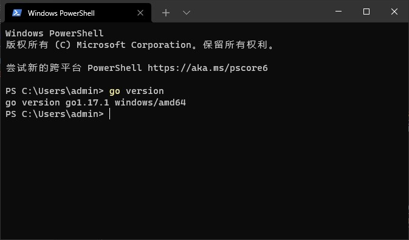

# Go简介

Go语言特点：

- 天生支持并发
- 执行性能好（编译型语言）
- 语法简单易学，开发效率高
- 具有垃圾回收

Go 被称为“21世纪的C语言”。

对我来说，我想学习go的缘由是因为这个项目：[Cloudreve](https://github.com/cloudreve/Cloudreve)，其部署方便，并且在我的 NAS 上运行得很好，因此，我觉得能写出如此好用的软件的语言值得一学！

## 搭建开发环境

1. 安装Go开发包：
   - 到官方网站 [https://golang.org/](https://golang.org/)（国内镜像站：[https://golang.google.cn/](https://golang.google.cn/)）下载最新的安装包，直接安装即可。
   - 下载好后，打开 powershell，输入 `go version`，如果出现 go 版本号，说明安装成功。
     
2. 配置 `GOPATH`（可选）
   - `GOPATH` 是一个环境变量，用来表明go项目的工作目录
   - 在 Go1.14 及之后的版本中启用了 Go Module 模式之后，不一定非要将代码写到 `GOPATH` 目录下，所以也就不需要我们再自己配置 `GOPATH` 了，使用默认的即可。
3. 配置 `GOPROXY`
   - 默认配置是 `GOPROXY=https://proxy.golang.org,direct`
   - 为了便于访问，用下面代码修改 `GOPROXY`
     
     ```powershell
     go env -w GOPROXY=https://goproxy.cn,direct
     ```
4. 配置 VS Code
   - 安装 VS Code
   - 安装 Go 扩展插件
   - 在写代码时会提示安装工具，点全部安装

## Hello World

1. 用 go  module 新建项目
   ```powershell
   go mod init Hello_World
   ```
2. 编写代码，新建 `main.go` 文件，内容如下：
   ```go
   package main  // 声明 main 包，表明当前是一个可执行程序

   import "fmt"  // 导入内置 fmt 包

   func main(){  // main函数，是程序执行的入口
       fmt.Println("Hello World!")  // 在终端打印 Hello World!
   }
   ```
3. 编译文件，运行 `go build` 命令
4. 执行文件，运行 `.\Hello_World.exe` 命令
5. 我们也可以将第 3、4 步合在一起做，只需要运行 `go run main.go` 命令即可

## 对 Hello World 的解释

**Go 语言的代码通过包（package） 组织**，包类似于其它语言里的库（libraries）或者模块（modules）。一个包由位于单个目录下的一个或多个 .go 源代码文件组成，目录定义包的作用。每个源文件都以一条 package 声明语句开始，这个例子里就是 `package main`，表示该文件属于哪个包，紧跟着一系列导入（import）的包，之后是存储在这个文件里的程序语句。

Go 的标准库提供了 100 多个包，以支持常见功能，如输入、输出、排序以及文本处理。比如 `fmt` 包，就含有格式化输出、接收输入的函数。`Println` 是其中一个基础函数，可以打印以空格间隔的一个或多个值，并在最后添加一个换行符，从而输出一整行。

`main` 包比较特殊。**它定义了一个独立可执行的程序，而不是一个库**。在 `main` 里的`main()` 函数 也很特殊，**它是整个程序执行时的入口**（译注：C 系语言差不多都这样）。main 函数所做的事情就是程序做的。当然了，`main()` 函数一般调用其它包里的函数完成很多工作（如：`fmt.Println()`）。

必须告诉编译器源文件需要哪些包，这就是跟随在 `package` 声明后面的 `import` 声明扮演的角色。

随后，则是组成程序的函数、变量、常量、类型的声明语句（分别由关键字 `func`、`var`、`const`、`type` 定义）（另外，**语句必须放在函数内**）。这些内容的声明顺序并不重要（译注：最好还是定一下规范）。这个例子的程序已经尽可能短了，只声明了一个函数，其中只调用了一个其他函数。为了节省篇幅，有些时候示例程序会省略 `package` 和 `import` 声明，但是，**这些声明在源代码里有，并且必须得有才能编译**。

Go 语言不需要在语句或者声明的末尾添加分号，除非一行上有多条语句。实际上，编译器会主动把特定符号后的换行符转换为分号，因此换行符添加的位置会影响 Go 代码的正确解析。

Go 语言在代码格式上采取了很强硬的态度。gofmt 工具把代码格式化为标准格式（译注：这个格式化工具没有任何可以调整代码格式的参数，Go 语言就是这么任性），并且 go 工具中的 fmt 子命令会对指定包，否则默认为当前目录中所有 .go 源文件应用 gofmt 命令。